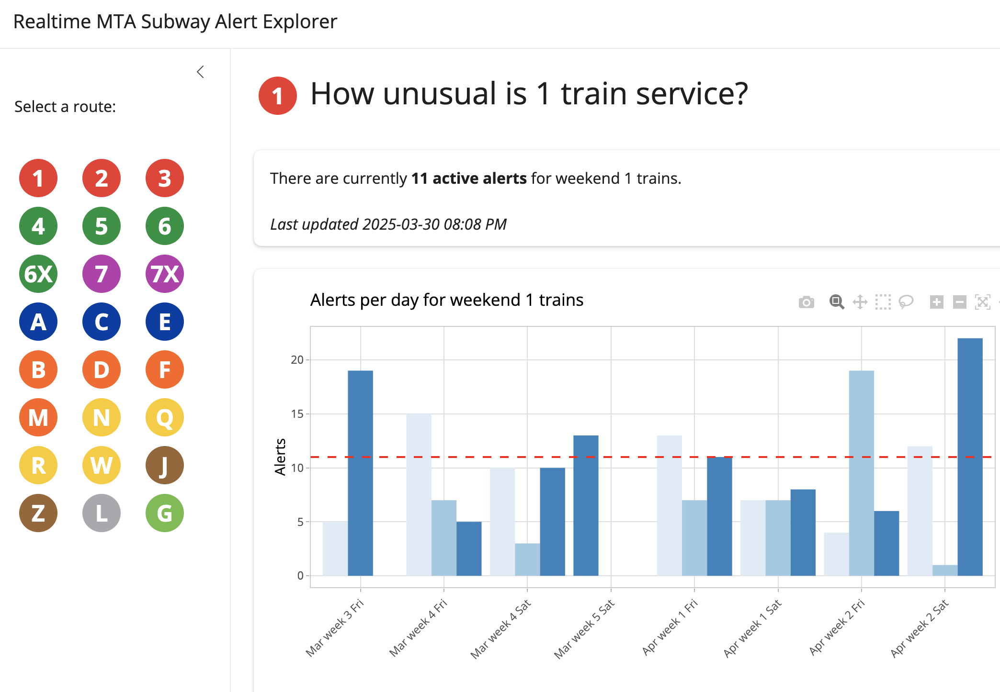
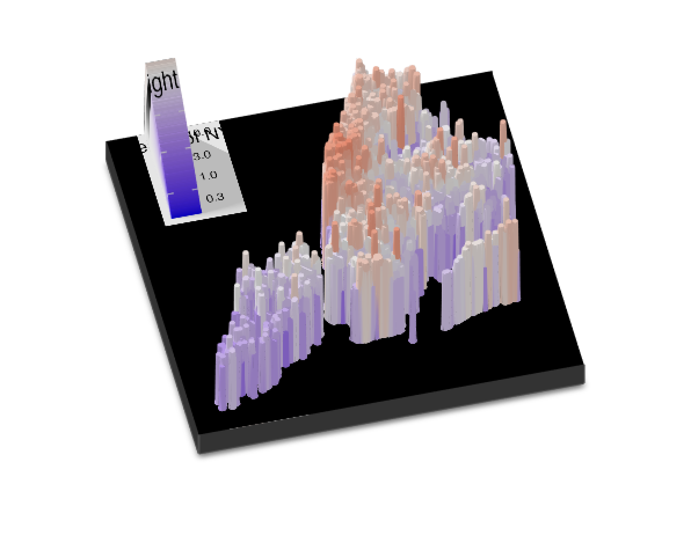
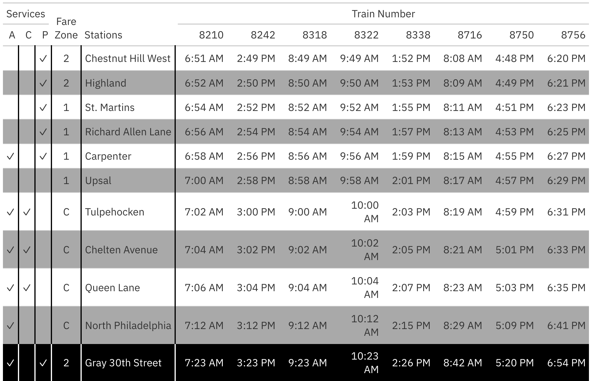

Anthony W. Baker

## Featured

:::::: grid
::: g-col-4

[**Realtime GTFS Subway Alerts Dashboard**](https://bakerlabs.shinyapps.io/mta_transit_health/)

Realtime dashboard using GTFS data to explore current NYC subway alerts.
:::

::: g-col-4
 [**Tidy Tuesday: NYC Elevators**](tidy_tuesday_nyc_elevators/tidy_tuesday_nyc_elevators.qmd)

Exploring the tallest and fastest elevators in the five boroughs.
:::

::: g-col-4
 [**SEPTA Transit Timetables**](septa_transit_times/septa-timetables.qmd)

Using Great Tables to style presentation-worthy transit data.
:::
::::::

## About Me

I'm a product manager and data scientist with experience at education, analytics, and AI companies. I'm obsessed with first principles and decision science: blending quantitative techniques (like analytics and modeling) and qualitative techniques (like JTBD research, business opportunity sizing, et al.) to help orgs make great decisions fast.

Interested in working together? [Let me know](mailto:anthonywbaker1@gmail.com).

## All Analyses

-   [Analyzing sentiment on r/ProductManagement](reddit_sentiment/reddit_sentiment.qmd): Simple sentiment analysis to get the vibe shift among product managers.

-   [Realtime GTFS Subway Alerts Dashboard](https://bakerlabs.shinyapps.io/mta_transit_health/): Realtime dashboard using GTFS data to explore current NYC subway alerts.

-   [NYC Elevators](/tidy_tuesday_nyc_elevators/tidy_tuesday_nyc_elevators.qmd): Exploring the tallest and fastest elevators in NYC.

-   [SEPTA Transit Timetables](septa_transit_times/septa-timetables.qmd): Using Great Tables to style presentation-worthy transit data.